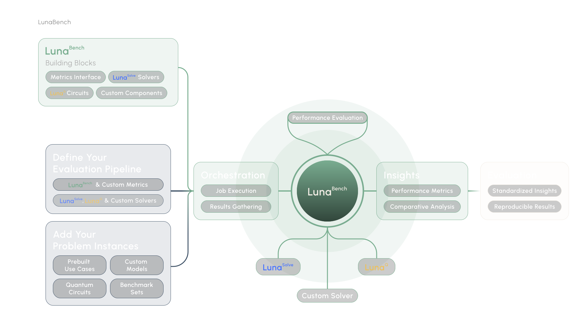

<div align="center">
  
</div>

# Luna-Bench

A framework for benchmarking optimization algorithms across quantum and classical domains. Define your models, plug
in solvers, and compare results with predefined features and metrics. Add plots to visualize your benchmark results.

> **Alpha Notice:** Luna-Bench is still in alpha. Many things are not final — for example, how metrics and features are
> accessed in plots is something we are still actively experimenting with to find the best approach. We highly welcome
> any user input and feedback! Feel free to open an issue or start a discussion.

## Why

Benchmarking optimization algorithms is tedious. You end up writing the same infrastructure over and over: result
storage, metric computation, plotting, managing model sets. Luna-Bench handles all of that so you can focus on the
algorithms themselves. Features and metrics are tested and reused across benchmarks, which means fewer bugs and more
consistent results.

- Compare quantum and classical solvers by adding algorithms easily from luna_quantum or add your own
- Persistent storage for results and configurations via SQLite
- Built-in metrics like approximation ratio, time to solution, and fraction of best solution
- Extensible through custom algorithms, metrics, features, and plots if desired
- Full type safety with Pydantic validation
- Reproducible benchmarks with database-backed result tracking

<div align="center">
  
</div>

## Installation

Requires Python 3.13+.

```bash
pip install luna-bench
```

## Quick Start

> **macOS Note:** Due to a known macOS issue with multiprocessing, you need to set the start method before other imports:
>
> ```python
> import multiprocessing
> multiprocessing.set_start_method("fork")
> ```

### Define your models

```python
from luna_quantum import Model, Variable
from luna_bench.components import ModelSet

# Build a simple optimization model
model = Model("example")
with model.environment:
    x = Variable("x")
    y = Variable("y")
model.objective = x * y + x
model.constraints += x >= 0
model.constraints += y <= 5

# Group models into a set
modelset = ModelSet.create("my_models")
modelset.add(model)
```

### Run a benchmark

```python
from luna_bench.components import Benchmark
from luna_bench.components.algorithms.scip import ScipAlgorithm
from luna_bench.components.features.optsol_feature import OptSolFeature
from luna_bench.components.metrics.approximation_ratio import ApproximationRatio
from luna_bench.components.plots import AverageFeasibilityRatioPlot

benchmark = Benchmark.create("my_benchmark")
benchmark.set_modelset(modelset)

# Add a solver
benchmark.add_algorithm("scip", ScipAlgorithm(max_runtime=60))

# Add a feature that computes the optimal solution (used by metrics)
benchmark.add_feature("optimal_solution", OptSolFeature())

# Add a metric to evaluate solution quality
benchmark.add_metric("approx_ratio", ApproximationRatio())

# Add a plot to visualize metric results
benchmark.add_plot("approx_plot", AverageFeasibilityRatioPlot())

# Run everything: features, algorithms, metrics, plots
benchmark.run()
```

That's it. Luna-Bench runs your solvers against every model in the set, computes features, evaluates metrics, and stores the results.

### Write your own algorithm

Subclass `BaseAlgorithmSync` and register it with the `@algorithm` decorator.

```python
from luna_bench.base_components import BaseAlgorithmSync
from luna_bench.helpers import algorithm
from luna_quantum import Model, Solution

@algorithm()
class MyAlgorithm(BaseAlgorithmSync):
    max_iterations: int = 1000

    def run(self, model: Model) -> Solution:
        # Your solver logic here
        ...
```
### Write your own feature

Features extract properties from models. They run before algorithms and metrics.

```python
from luna_bench.base_components import BaseFeature
from luna_bench.helpers import feature
from luna_bench.types import FeatureResult
from luna_quantum import Model

class MyFeatureResult(FeatureResult):
    num_variables: int

@feature
class MyFeature(BaseFeature):
    def run(self, model: Model) -> MyFeatureResult:
        return MyFeatureResult(num_variables=model.num_variables)
```

### Write your own metric

Metrics evaluate solutions. They can depend on features for reference data like optimal solutions.

```python
from luna_bench.base_components import BaseMetric
from luna_bench.base_components.data_types.feature_results import FeatureResults
from luna_bench.helpers import metric
from luna_bench.types import MetricResult
from luna_quantum import Solution

class MyMetricResult(MetricResult):
    score: float

@metric()
class MyMetric(BaseMetric):
    def run(self, solution: Solution, feature_results: FeatureResults) -> MyMetricResult:
        score = solution.expectation_value()
        return MyMetricResult(score=score)
```

## Development

```bash
# Install dependencies
uv sync

# Install pre-commit hooks (runs linting, formatting, type checking, and tests on each commit)
pre-commit run . --all-files
```

## License

This project is licensed under the Apache License 2.0 - see the [LICENSE](LICENSE) file for details.

## Acknowledgments

Built by the Aqarios team.
