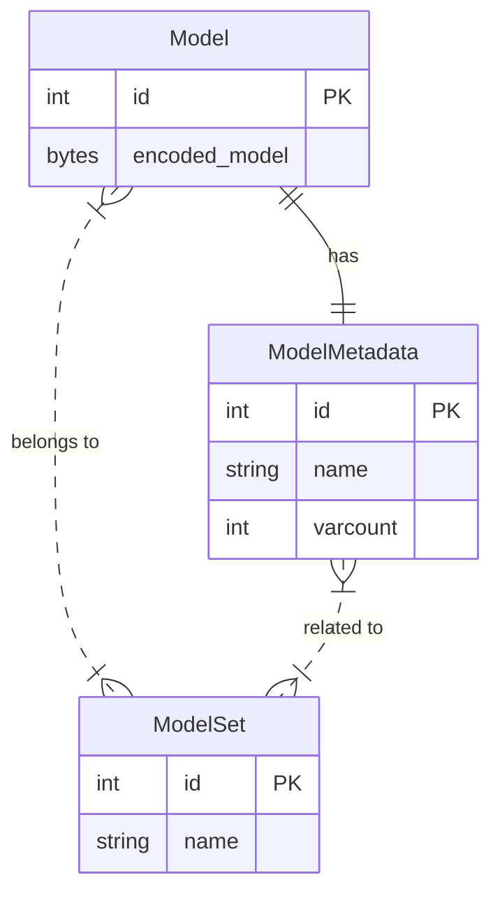

```mermaid
erDiagram
    Model ||--|| ModelMetadata: has
    Model }|..|{ ModelSet: "belongs to"
    ModelMetadata }|..|{ ModelSet: "related to"

    Model {
        int id PK
        bytes encoded_model
    }

    ModelMetadata {
        int id PK
        string name
        int varcount
    }

    ModelSet {
        int id PK
        string name
    }


```
