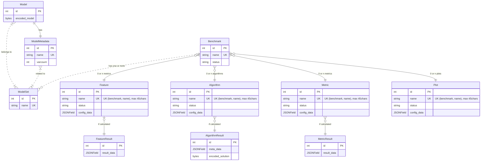

```mermaid
erDiagram
    Model ||--|| ModelMetadata: has
    Model }|..|{ ModelSet: "belongs to"
    ModelMetadata }|..|{ ModelSet: "related to"
    Benchmark o|..o{ ModelSet: "has one or none"
    Benchmark }o--|| Feature: "0 or n metrics"
    Benchmark }o--|| Algorithm: "0 or n algorithms"
    Benchmark }o--|| Metric: "0 or n metrics"
    Benchmark }o--|| Plot: "0 or n plots"
    Feature |o--|| FeatureResult: "if calculated"
    Algorithm }o--|| AlgorithmResult: "if calculated"
    Metric }o--|| MetricResult: "if calculated"

    Model {
        int id PK
        bytes encoded_model
    }

    ModelMetadata {
        int id PK
        string name UK
        int varcount
    }

    ModelSet {
        int id PK
        string name UK
    }

    Benchmark {
        int id PK
        string name UK
        string status
    }

    Feature {
        int id PK
        string name UK "UK (benchmark, name), max 45chars"
        string status
        JSONField config_data
    }

    FeatureResult {
        int id PK
        JSONField result_data
    }

    Metric {
        int id PK
        string name UK "UK (benchmark, name), max 45chars"
        string status
        JSONField config_data
    }

    MetricResult {
        int id PK
        JSONField result_data
    }

    Algorithm {
        int id PK
        string name UK "UK (benchmark, name), max 45chars"
        string status
        JSONField config_data
    }

    AlgorithmResult {
        int id PK
        JSONField meta_data
        bytes encoded_solution
    }

    Plot {
        int id PK
        string name UK "UK (benchmark, name), max 45chars"
        string status
        JSONField config_data
    }


```
