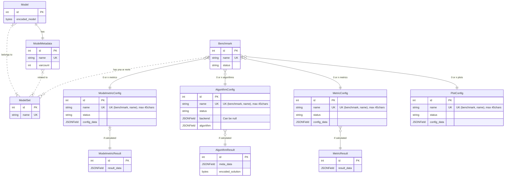

```mermaid
erDiagram
    Model ||--|| ModelMetadata: has
    Model }|..|{ ModelSet: "belongs to"
    ModelMetadata }|..|{ ModelSet: "related to"
    Benchmark o|..o{ ModelSet: "has one or none"
    Benchmark }o--|| ModelmetricConfig: "0 or n metrics"
    Benchmark }o--|| AlgorithmConfig: "0 or n algorithms"
    Benchmark }o--|| MetricConfig: "0 or n metrics"
    Benchmark }o--|| PlotConfig: "0 or n plots"
    ModelmetricConfig |o--|| ModelmetricResult: "if calculated"
    AlgorithmConfig }o--|| AlgorithmResult: "if calculated"
    MetricConfig }o--|| MetricResult: "if calculated"

    Model {
        int id PK
        bytes encoded_model
    }

    ModelMetadata {
        int id PK
        string name UK
        int varcount
    }

    ModelSet {
        int id PK
        string name UK
    }

    Benchmark {
        int id PK
        string name UK
        string status
    }

    ModelmetricConfig {
        int id PK
        string name UK "UK (benchmark, name), max 45chars"
        string status
        JSONField config_data
    }

    ModelmetricResult {
        int id PK
        JSONField result_data
    }

    MetricConfig {
        int id PK
        string name UK "UK (benchmark, name), max 45chars"
        string status
        JSONField config_data
    }

    MetricResult {
        int id PK
        JSONField result_data
    }

    AlgorithmConfig {
        int id PK
        string name UK "UK (benchmark, name), max 45chars"
        string status
        
        JSONField backend "Can be null"
        JSONField algorithm
    }

    AlgorithmResult {
        int id PK
        JSONField meta_data
        bytes encoded_solution
    }

    PlotConfig {
        int id PK
        string name UK "UK (benchmark, name), max 45chars"
        string status
        JSONField config_data
    }


```
