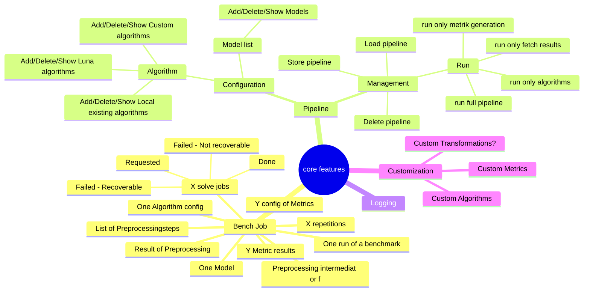

# This file descibes the high-level architecture of luna-bench

## Mindmap of ideas/features etc

```mermaid
mindmap
  root((core features))
    Bench Job
        One run of a benchmark
        One Model
        One Algorithm config
        List of Preprocessingsteps
        Result of Preprocessing
        Preprocessing intermediat or f
        X repetitions
        X solve jobs
            Requested
            Failed - Recoverable
            Failed - Not recoverable
            Done
        Y config of Metrics
        Y Metric results

    Pipeline
        Configuration
            Algorithm
                Add/Delete/Show Local existing algorithms
                Add/Delete/Show Luna algorithms
                Add/Delete/Show Custom algorithms
            Model list
                Add/Delete/Show Models
        Management
            Run
                run full pipeline
                run only algorithms
                run only metrik generation
                run only fetch results

            Load pipeline
            Store pipeline
            Delete pipeline

    Logging
    Customization
        Custom Transformations?
        Custom Algorithms
        Custom Metrics

```
