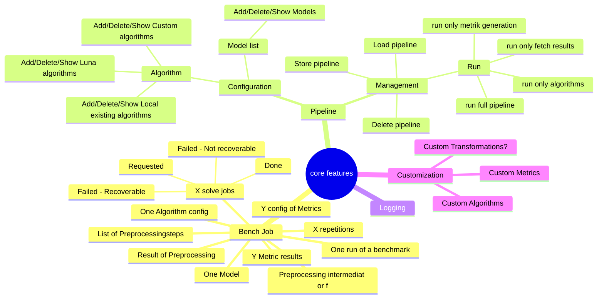
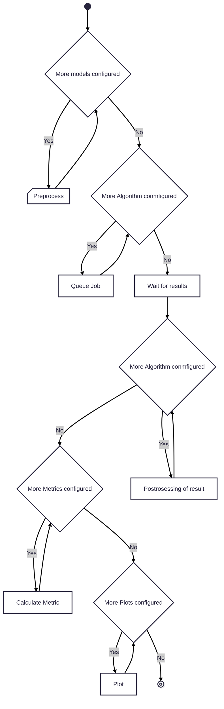
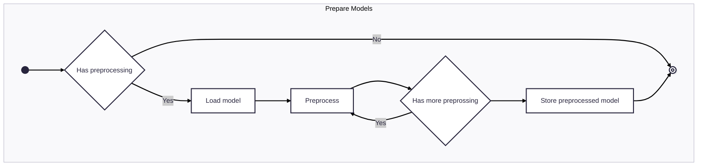

# This file descibes the high-level architecture of luna-bench

## Mindmap of ideas/features etc

## Pipeline/Bench job

### Preprocessing

### Algorithm execution

```mermaid
flowchart TD
 subgraph s1["Async Run"]
        n7["Run Async"]
        n8["Load Model"]
        n9["Run User Interface"]
        n10["Signal Job Id"]
        n30["Filled Circle"]
        n32["Frames Circle"]
  end
 subgraph s2["Sync Run"]
        n1["Run"]
        n2["Load Model"]
        n3["Run User Interface"]
        n4["Store Result"]
        n5["Signal Done"]
        n29["Filled Circle"]
        n31["Frames Circle"]
  end
 subgraph s3["Async Retriever"]
        n26["Filled Circle"]
        n18["Is Async Task remaining"]
        n25["Frames Circle"]
        n22["Get Async Job"]
        n23["Loader Interface"]
        n19["Retrieve Result"]
        n20["Is Done/Error"]
        n27["Result changed"]
        n28["Update Result"]
  end
    n1 --> n2
    n2 --> n3
    n3 --> n4
    n4 --> n5
    n7 --> n8
    n8 --> n9
    n9 --> n10
    n18 -- Yes --> n22
    n22 --> n23
    n23 --> n19
    n20 -- Yes --> n18
    n20 -- No --> n22
    n18 --> n25
    n26 --> n18
    n19 --> n27
    n27 -- No --> n20
    n27 --> n28
    n28 --> n20
    n29 --> n1
    n30 --> n7
    n5 --> n31
    n10 --> n32
    n9@{ shape: card}
    n30@{ shape: f-circ}
    n32@{ shape: fr-circ}
    n3@{ shape: card}
    n29@{ shape: f-circ}
    n31@{ shape: fr-circ}
    n26@{ shape: f-circ}
    n18@{ shape: diam}
    n25@{ shape: fr-circ}
    n23@{ shape: card}
    n20@{ shape: diam}
    n27@{ shape: diam}
    n28@{ shape: rect}

```

## Core components
- Model
- Model Preprocessing
- Algorithm
- Result/Solution
- Result/Solution Postprocessing
- Metrik
