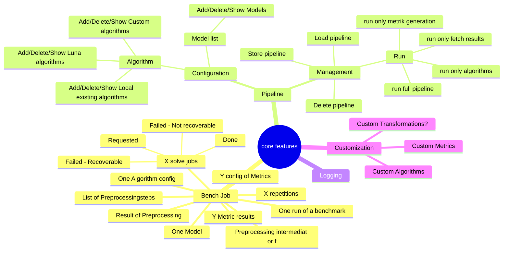
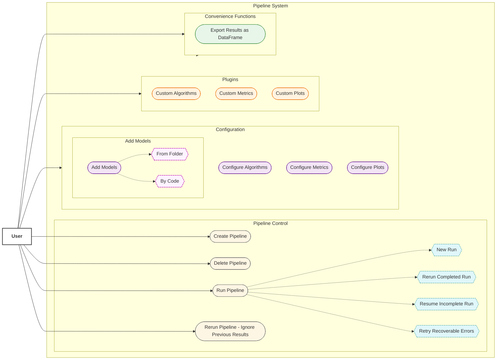
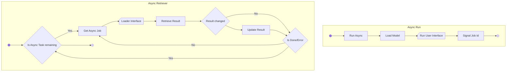
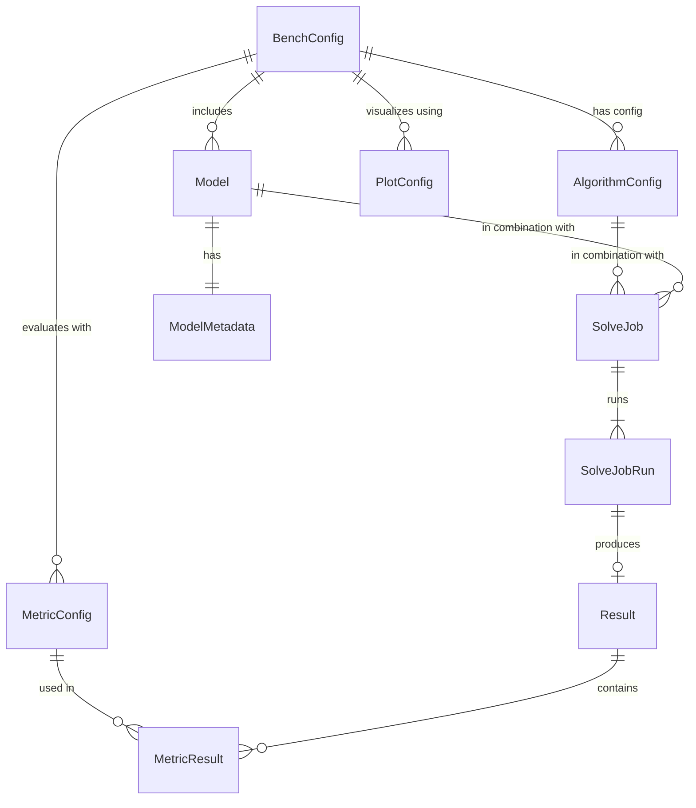

# This file descibes the high-level architecture of luna-bench

## Mindmap of ideas/features etc

## Usecase

## Pipeline/Bench job

```mermaid
---
config:
  theme: redux
  layout: fixed
---
flowchart LR
    start["Start"] --> validate(["Validate pipeline"])
    validate ---> features(["Compute features<br>(e.g. nr. variables, constraints)"])
    features --> solvers["Run solver<br>(for each algorithm - schedule job)"]
    solvers --> queue["Job Queue"]
    queue --> collect>"Collect / wait for results"]
    collect --> metrics(["Compute metrics<br>(for each metric)"])
    metrics --> plots(["Generate plots<br>(for each plot)"])
    plots --> done["Done"]
    validate -- Load pipeline config --> db1[("SQLite DB")]
    db1 -- Status, schema --> validate
    features -- Store features --> db2[("SQLite DB")]
    db2 -- Config, model data --> features
    solvers -- Store job info --> db3[("SQLite DB")]
    db3 -- Algorithm config --> solvers
    collect -- Store raw results --> db4[("SQLite DB")]
    db4 -- Job results --> collect
    metrics -- Store metrics --> db5[("SQLite DB")]
    db5 -- Raw results --> metrics
    plots -- Store plots --> db6[("SQLite DB")]
    db6 -- Metric values --> plots
    start@{ shape: f-circ}
    solvers@{ shape: subproc}
    queue@{ shape: h-cyl}
    done@{ shape: fr-circ}
     db1:::db
     db2:::db
     db3:::db
     db4:::db
     db5:::db
     db6:::db
    classDef db fill:#f0f0f0,stroke:#999,stroke-width:2px


```

### Algorithm execution

## Core components
- Model
- Model Metadata (from Compute features)
- Algorithm
- Solve Job Status
- Result/Solution
- Result/Solution Postprocessing
- Metrik

## Stuff we need
- DB => sqlite for now
- Queuing => [Huey](https://github.com/coleifer/huey)
  - Looks well maintained
  - SQLight based queues possible
- [Returns Lib](https://pypi.org/project/returns/#description) for better error handling and cleaner code
- Pydantic
- Luna-Quantum
